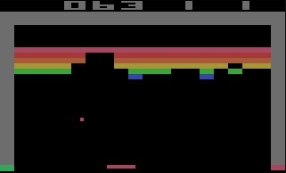
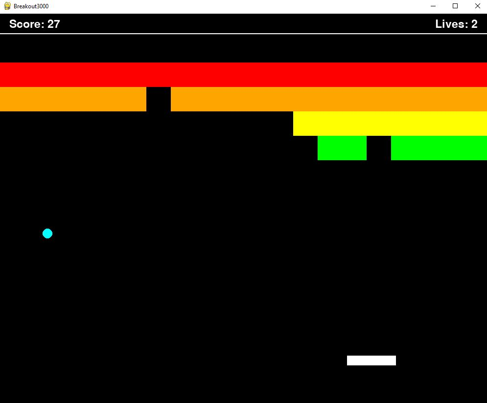

Project-1-Breakout-Documentation
================================
**A take on the classic game 'breakout'**

Emphasis on:

- Collision Physics
- Player input
- Frame rates in games
- Game loops

Gameplay
--------

This game plays like the classic ATARI game of the same name.

.. Game Screenshot

Designing *Breakout* in pygame is not a difficult task. The rules of the game are simple:

- You have a bouncing ball that can be redirected by bouncing it off of a paddle which you can move left or right
- When the ball hits a *brick* on the ceiling, it breaks
- To win, you need to break all of the bricks
- You lose (or lose points) when the ball hits the ground if you fail to bounce it with your paddle
  
My implementation looks slightly different:

.. Game Screenshot

Implementing the Game
---------------------

The game breakout can be implemented using relatively little complex logic by
relying on comparisions between the ball and paddle so as to register collisions if their coordinates overlap
a certain defined or changing boundry.

*i.e.: The moving paddle's edges*

The same goes for the balls and bricks, if a ball's coordinates in the game overlap with brick edges, the brick should break.

While this can all be implemented using coordinate comparisons, with the paddle the task becomes a little trickier when you consider
ball on paddle collisions versus square on paddle collisions. Obviously we want to be able to accurately reflect the ball based
on where and from direction it has hit the paddle - so you need special cases for the sides and the top which can be compared and registered.

In looking into collision physics, I realize pygame's **sprite API** does a lot of the grunt work, and in addition, allows for multiple different 
shapes to be used - ergo, my game works for either square or circular balls.

See Pygame's Sprite Collision API (https://www.pygame.org/docs/ref/sprite.html#pygame.sprite.spritecollide) for more details.

Additional Features:
--------------------

My Breakout implementation also features a scoring system (like the original), which registers how many bricks you have hit.

It also has a lives system (unlike the original) so you can afford to miss the ball a few times. This accomadates individuals such myself
who are considerably terrible at this game.

I also made a cheat mode that gives you infinite lives.

You can also use multiple balls as well.

The sounds are a little meme-y to say the least with the classic `vine-boom` and `taco-bell-ring` responding
to paddle and brick collisions.

    
