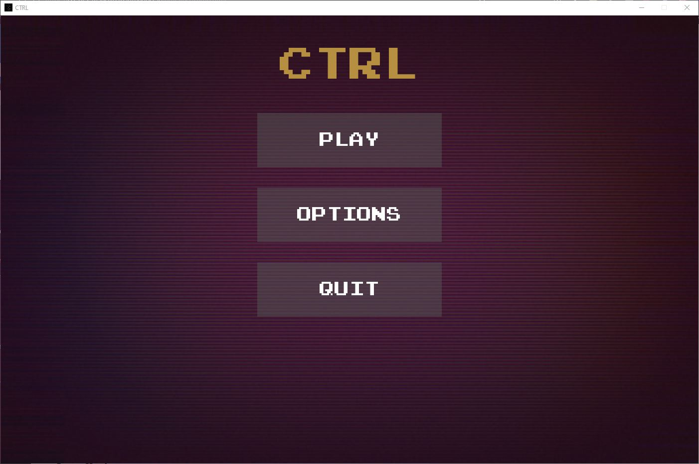
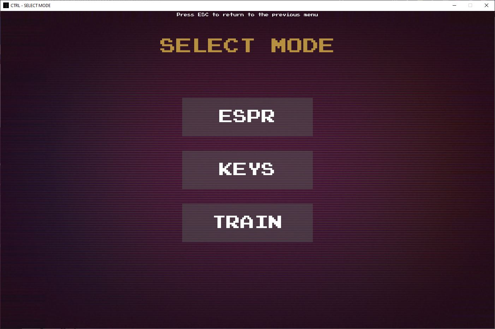
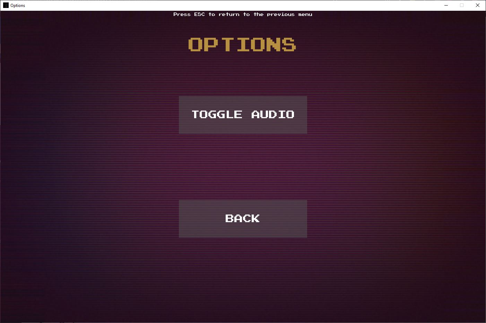
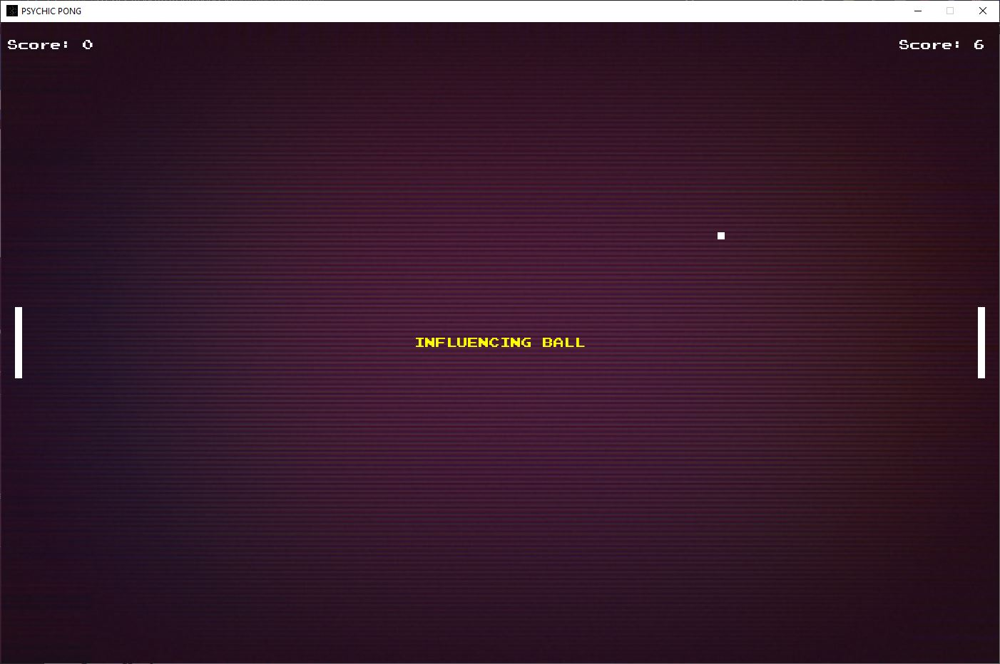
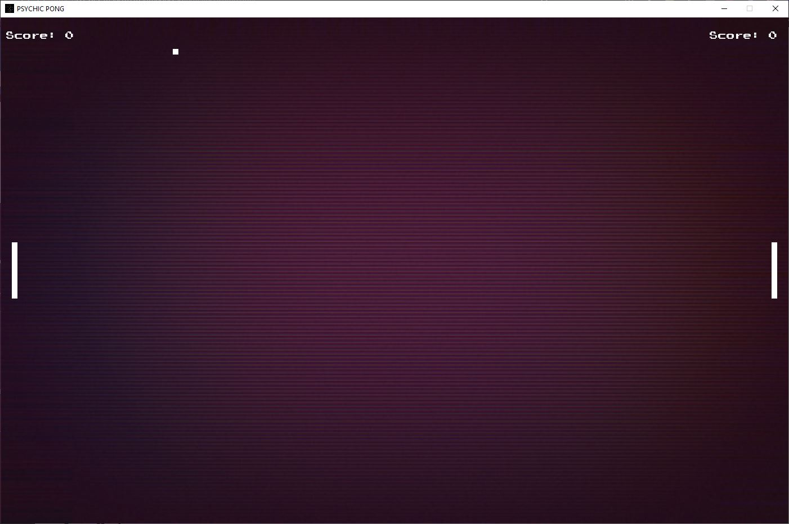
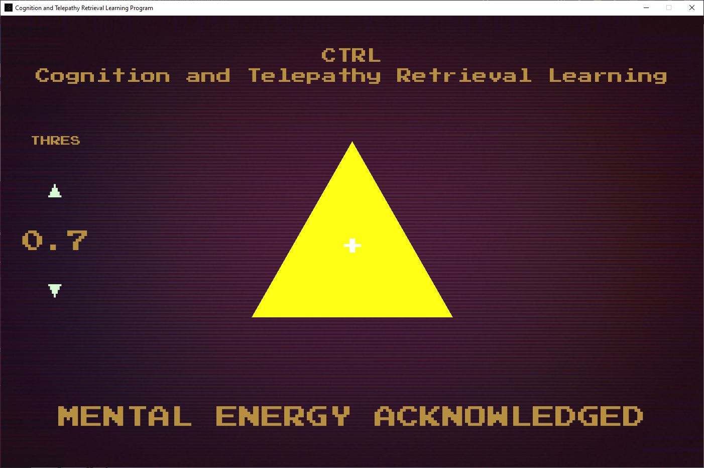
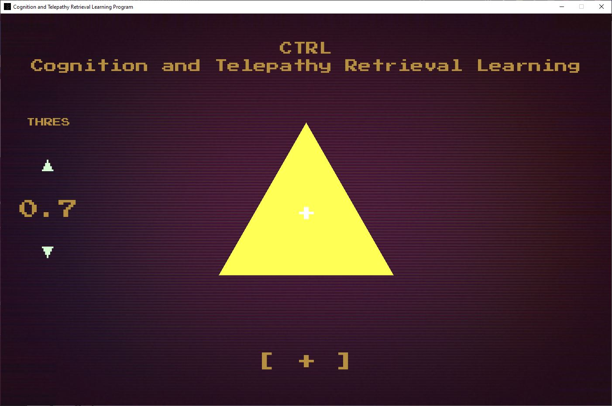

CTRL
====

**A game demonstrating input using bioactivity**

Menus
-----

Main - Menu
~~~~~~~~~~~~

This is the starting point through which different game modes and options can be selected.

Game Select Menu
~~~~~~~~~~~~~~~~

This is the menu you select one of three games through.

Options Menu
~~~~~~~~~~~~

You can toggle audio on or off with this menu. Same functionality as the 
toggle-audio button in the MAESTRO options menu.

Games 
-----

CTRL
~~~~

A spin on the classic game **Pong**, with the added feature of using your ability
to willingly concentrate on the ball to speed it up!

It also sports a threshold dial at the bottom to lower or increase the threshold 
of concentration to trigger the influence on the ball

KEYS
~~~~

An EEG - device free demo of CTRL:

A spin on the classic game **Pong**, with the added feature of using your ability
to click the space bar to influence the ball by speeding it up as it approaches your 
opponent!

TRAIN
~~~~~

A mode for training your ability to willingly concentrate more or less.
Despite how unintuitive the ability to do this may seem, it is a skill you
can train rather quickly.
This is based on the concept of Neurofeedback. (https://www.ncbi.nlm.nih.gov/pmc/articles/PMC4892319/)

This mode involves a triangle that turns a more solid bright yellow with higher concentration, 
and fades to a white as your estimated level of concentration reaches zero.

To the left is a dial for controlling the threshold for activating the mental
energy threshold which will display a message beneath the triangle.

*You can also run this mode with a demo if you have no device, this sub-mode generates a random float
between 0.0 - 1.0 every 3 seconds mimicking what the interface would look like if you
were using brain activity instead*

