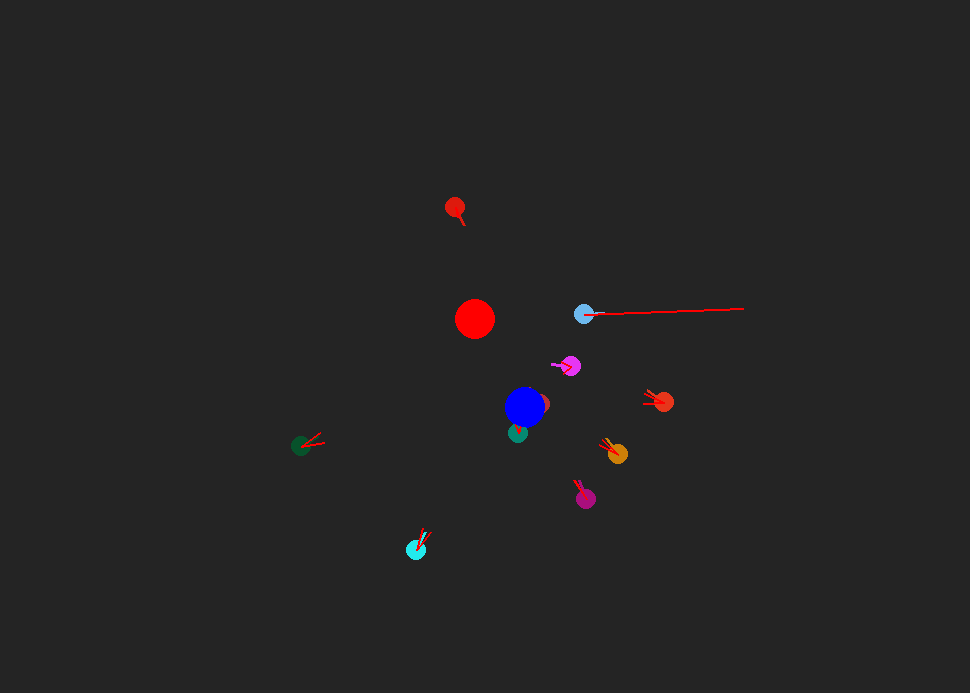

Project-3-Flocking-Documentation
================================
**Demonstration of basic flocking algorithms for Agents in games**

Emphasis on:

- MultiAgent Scenarios
- Flocking behaviors

**Premise** Flocking AI behaviors are common in games typically in the RTS (*Real Time Strategy*) games. Games such as DOTA or Starcraft II involve 
flocking AI which all move together towards goals some indivudal behaviors for each AI agent.

Gameplay
--------

The gameplay of this flocking demonstration is incredibly simple.

The singular `target` which you control with your mouse is approached by a bunch of flocking agents.

When outside of a certain radius, the agents will approach your target. Once they are within a certain range, they will flee your target
to a safe distance where they can begin approaching your target again.

They also maintain a certain distance from eachother and have a weighted general velocity that keeps them all moving at relatively similar speeds.

The blue circle in this game represents the averaged position of all flocking agents

.. Game Screenshot

Implementation
--------------

The flocking agents have two primary behaviors they can express:

- seeking
- fleeing

The agents are constantly updated with their distance from the target, where the distance threshold for fleeing ditates when they switch their state from seeking to fleeing.

When fleeing, we dont want our agents to flee to the threshold then seek again, because this results in all the agents flipping at the distance threshold forever until the target
moves.
Hence, we keep the fleeing state active until it is slightly *further* than the distance threshold, such that the switch to seeking looks natural.

