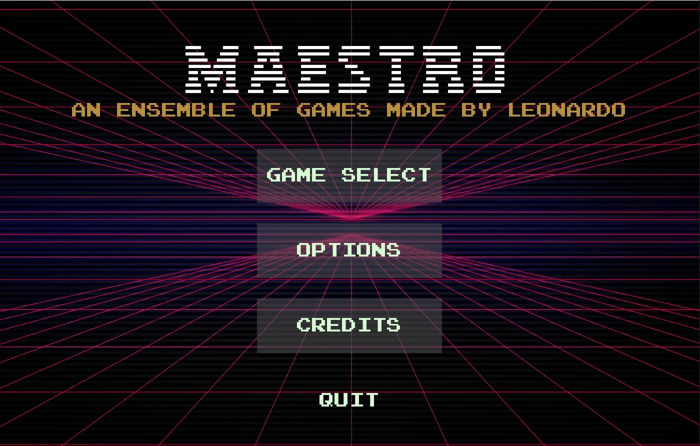
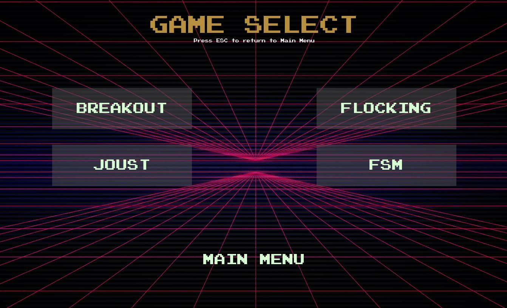
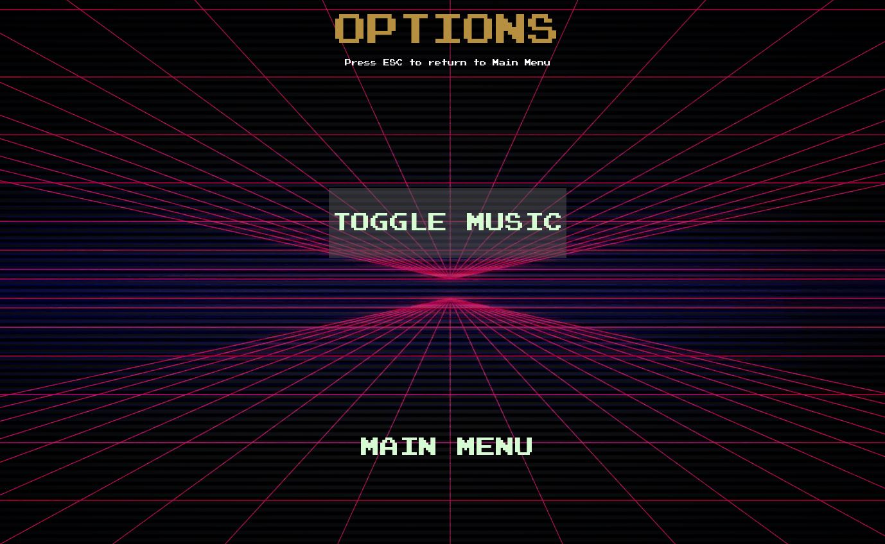
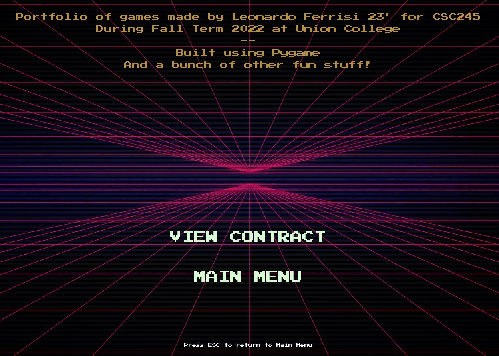

MAESTRO
=======

**An ensemble of games written from scratch to learn and teach computer game development**

The MAESTRO main menu
---------------------

What better way to show off my game development skills aquired then put them all into a central hub
making them accessible without needing to run each game individually.

By running **MAESTRO.py**, the user can access *most* or all of the games made during my game dev journey.

.. note:: 
    There may be an executable made as well - TBD

Themes and Design
-----------------

I have a soft spot for retro. Given the games made for this portfolio are on the simpler side, I figured I'd give the user 
interface a retro look and feel.

Everything from the fonts down to the backgrounds I edited in **paint.net** or the royalty free retro music adds to the atmosphere 
of a vintage game catalog.

User Interface
--------------

The MAESTRO menu has four options:

- GAME SELECT 
- OPTIONS 
- CREDITS 
- QUIT

Game Select 
~~~~~~~~~~~

Game Select has buttons that initiate the launch of each of the games they describe. In paticular, launching a game is achieved by passing through the menu
pygame surface object and running the game loop using that so as to avoid any new windows needing to be opened.

For all games, the **ESC** key can be pressed to return to GAME SELECT

.. note:: 
    In future iterations, it may be helpful to have a freeze functionality for each game to allow for a pop-up menu to request if the 
    player is certain they want to exit, just in case they didnt mean to click ESC

Options 
~~~~~~~

Pretty basic functionality, if the music is annoying - you can toggle it on or off from here.

Credits
~~~~~~~

Info on who designed this software, as well as a link to the github page with associated **.md** files.

QUIT 
~~~~

Exits the game. Same functionality as closing the window by clicking the 'X' mark

Using MAESTRO
-------------

Please see :doc:`setup` for more details.