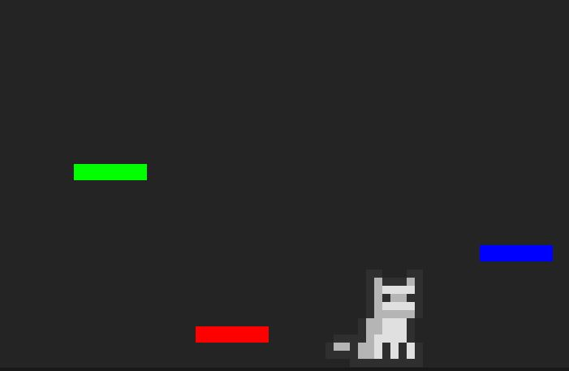
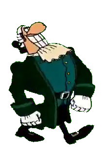
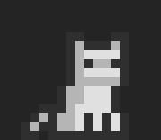
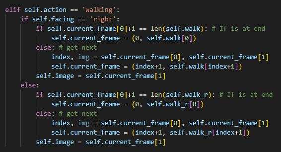
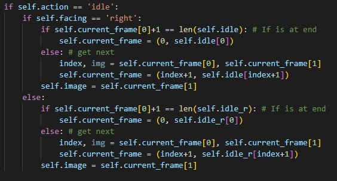

Project-2-Joust 
===============
**A basic bare-bones platformer**

Emphasis on:

- Collision Physics for moving player 
- Player and Environment Physics
- Sprite Animations
- Object Oriented Programming

Gameplay
--------

.. Game Screenshot

This game demonstartes basic concepts in platforming. The way which sprites collide
with the ground and platforms needs to feel natural, the animations needed to be smooth.

Collisions with multiple platforms requires the position of the player to be updated regularly as
it is moved around such that its position can be compared against that of the platforms.

There are typically two ways to accomplish natural collisions, you can either:

- [1] Regularly calculate and compare all the relevant points and evaluate them for overlap
- [2] **Use pygames built in sprite API which has more painless collision handling**

*I chose option 2* 

Sprite Collisions are much easier to do with the pygame **sprite** API since it accounts for the
strange shapes you might make a sprite without needing to re-adjust hitboxes for collisions.

It does however, always help if your sprite as clear edges. I learned this the hardway by making this fellow below my original
sprite attempt.

.. Dr.Livesey Image

**Sufficie to say**, hand removing the background from 32 different frames from some propoganda cartoon while amusing still resulted
in a sprite with odd edges that didnt collide well with objects. 

Animating the Sprite
--------------------

.. Image of the sprite

A static sprite is no fun, giving the sprite **moving** and **idle** animations was essential.

Moving Animation
~~~~~~~~~~~~~~~~

The **moving** animation was easy enough - if the player was moving at all, its frames would be being updated
anyways so as to allow it to appear in motion ( *It is really just being redrawn x times a second* )
When updating its frame, this chunk of code also updates the specific image from the sprite map to the next one - if it reaches
the last sprite animation frame, it loops around and starts from the first.

You'll notice that there is a state for facing right and left. While there is likely an easier way to do this - the current implementation
stores a set of all right-facing sprite images for the animation and a list of all of them flipped. The reason for this is, **paticularly
for walking animations**, the order needs to be inverted for the flip-facing animation as well otherwise you get a moon-walk effect when it walks
in the other direction to default.

The **walking** state is also important. It is only active when the player input is detected instructing our cat to move, if no input exists 
the sprite immediately switches to its idle state.

.. Image of code

Idle Animation 
~~~~~~~~~~~~~~

For the **idle** animation. The logic was similar enough to the moving code
however it needs to update every frame regardless of player input to be a proper
idle. Following some tweaks with the logic of animating the cat, the logic for both animations
is effectively the same. 

.. Image of code

