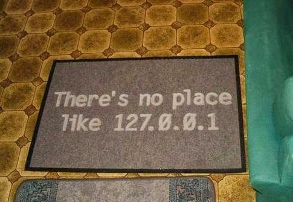

# CSC 245 - The Computer Science of Computer Games
### A journey in game development using python, pygame and other stuff too..
##### **by** *Leonardo Ferrisi* '23

---------------------------

#### Portfolio Site:

Associated with this class, I have made a site using **readthedocs**
available at: (https://csc245-maestro.readthedocs.io/en/latest/)

This Portfolio page functions as a manifest, guide, documentation page, dev-log source

### Contract:

Access Contract [**HERE**](./portfolio/contract.md)

### Projects

##### Baseline Projects

- [Baselines](portfolio\projects\project-1-baselines)
- [Collisions](portfolio\projects\project-3-collisions)

##### Actual Projects

- [Breakout](portfolio\projects\project-2-breakout)
- [Joust](portfolio\projects\project-4-joust)
- [Flocking](portfolio\projects\project-5-flocking)
- [Finite State Machines](portfolio\projects\project-6-fsm)
- [Path Planning](portfolio\projects\project-7-astar)
- [Networking](portfolio\projects\project-8-networking)

### Final Projects

- [mind-games](portfolio\projects\mind-games)
- [CTRL](portfolio\projects\ctrl)
- [simple-pygame-menus](portfolio\projects\simple-pygame-menus)

# KWL (Know, Want to Know, Learned) Chart

| Topic                       | Know    | Want to Know | Learned |
| ----------------------------| ------- | ------------ | ------- |
| Git                         |    x    |              |         |
| Linux  Terminal             |    x    |              |         |
| Markdown                    |    x    |              |         |
| ReStructuredText            |    x    |              |         |
| ReadTheDocs Documentation   |    x    |              |         |
| Object Oriented Python      |    x    |              |         |
| List Comprehensions         |    x    |              |         |
| SSH and SSH Keys            |    x    |              |         |
| Vector Math                 |    x    |              |         |
| Flocking Agents             |    x    |              |         |
| Finite State Machines       |         |       x      |         |
| Path Planning               |         |       x      |         |
| Sprites                     |    x    |              |         |
| Sprite Sheets and Animation |    x    |              |         |
| Pygame API for Collisions   |    x    |              |         |
| Pygame API for Music        |    x    |              |         |
| Making Game Menus in Pygame |    x    |              |         |
| Standards for Game Design   |         |       x      |         |
| Alternative Inputs for Games|    x    |              |         |
| Using Bio Activity as Input |    x    |              |         |

##### Currently Completed: 17/20 (**85%**)

---------------------------------

### Final Grade Bid

Based on the completed KWL objectives and the grading rubric detailed in my [contract](./portfolio/contract.md)

----------------

### Meme 
